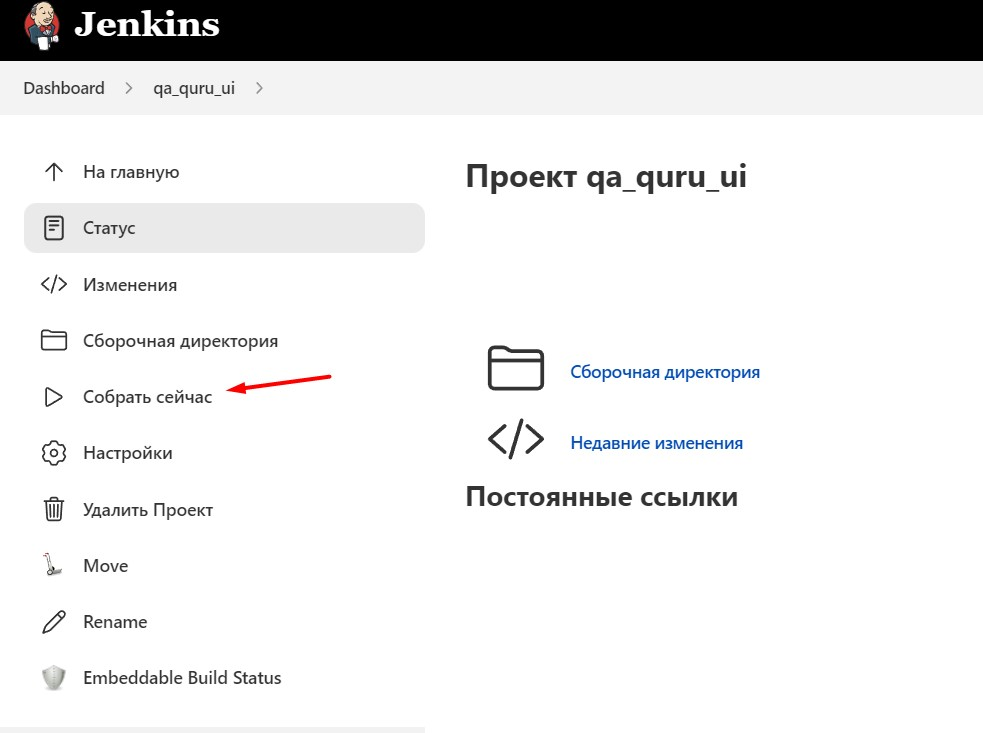
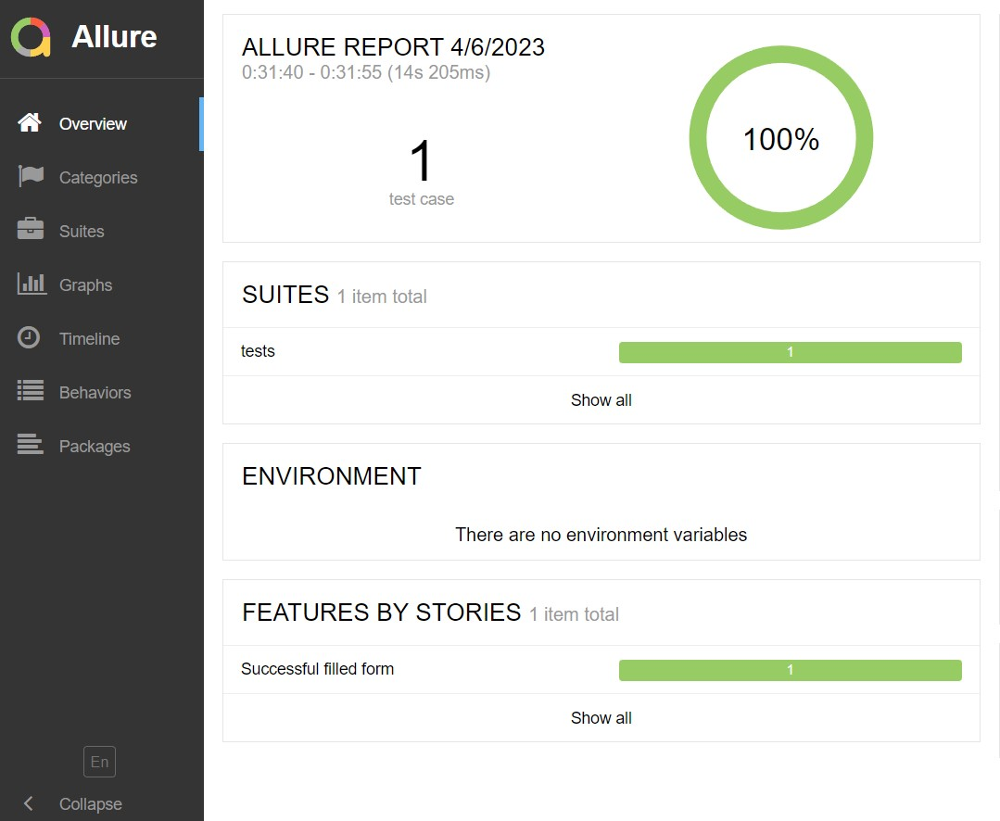
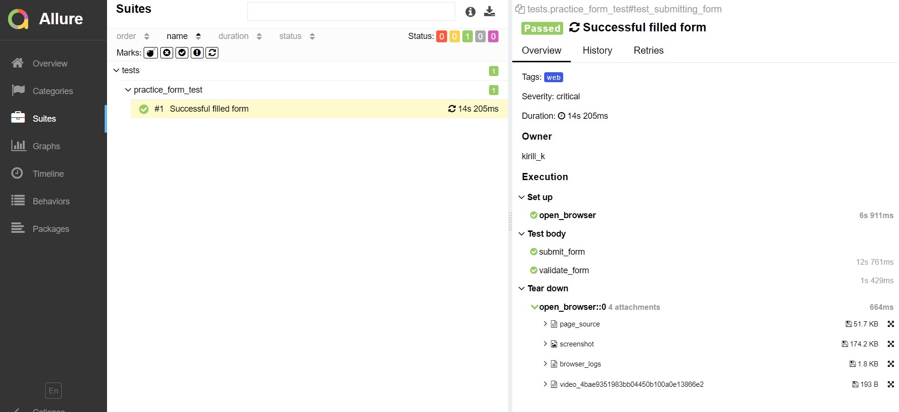
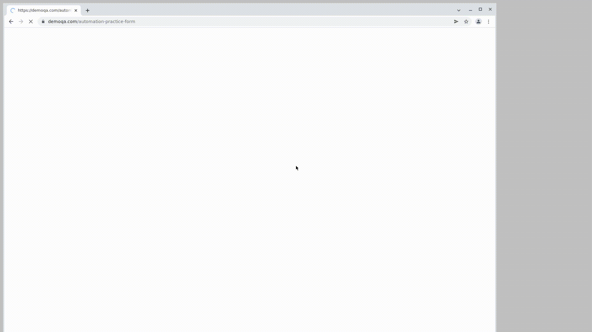

## Проект UI автотестов для сайта demoqa.com

<!-- Технологии -->

### Технологии

  <code></code>
  <code></code>
  <code></code>
  <code></code>
  <code></code>
  <code></code>
  <code></code>
  <code></code>

### Что проверяется в проекте:
- [x] Заполняем данные формы
- [x] Отправляем заполненную форму
- [x] Проверяем заполненные данные

<!-- Jenkins -->

###  Запуск проекта в Jenkins

### [Job](https://jenkins.autotests.cloud/job/qa_quru_ui/)

##### При нажатии на "Собрать сейчас" начнется сборка тестов и их прохождение, при помощи Selenoid.

<!-- Allure report -->

###  Allure report

##### После прохождения тестов, результаты сохраняются в виде Allure отчёта.

##### Во вкладке Suites находится детализированный отчёт с логами, скриншотами и видео прохождения теста.

##### Видео прохождение теста
